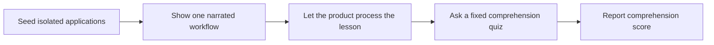
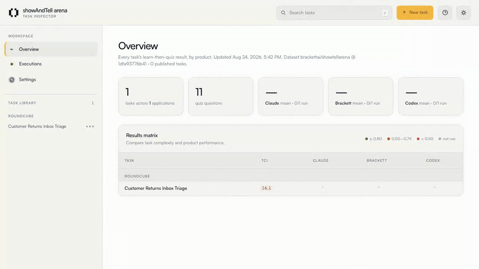

<div align="center">

# ShowAndTell-Bench

**Can an AI system learn a real workflow after seeing it once?**

[](pyproject.toml)
[](LICENSE)

[Quick start](#quick-start) · [Why ShowAndTell](#why-showAndTell) · [Run a benchmark](#run-a-benchmark) · [Add a task](#add-a-task) · [Contribute](CONTRIBUTING.md)


<sub>Pick a task, choose a product, and follow the run from setup through evaluation.</sub>

</div>

ShowAndTell-Bench evaluates **teach-by-demonstration systems**. A system watches
one narrated workflow in real applications, then answers a fixed quiz about
the process it learned. The benchmark measures comprehension, not just whether
the recorded clicks can be replayed.

## Quick start

Requires macOS or Linux with Python 3.12+ and, on macOS,
[Homebrew](https://brew.sh).

```bash
git clone https://github.com/bracketthq/showAndTell-arena.git
cd showAndTell-arena
./showAndTell setup
./showAndTell viewer
```

Open <http://localhost:8000> and pick a task: watch its demonstration
recording, read the narration script, and browse the quiz. This part needs
nothing beyond Python — the published tasks arrive during setup, and
`./showAndTell dataset-pull` updates them to the latest dataset release
(`--revision v0.1` pins an exact one).

`./showAndTell setup` builds the virtual environment, installs Chromium and the
macOS recording tools, checks Docker, prepares the managed Chrome profile, and
fetches the task dataset. Expect about 15 minutes; if the audio driver asks
for a reboot, reboot and run setup again. Setup does not open Chrome; the first
Brackett run guides you through installing the extension if it is missing.

## Why ShowAndTell

Most agent benchmarks begin with a written instruction. ShowAndTell-Bench begins
one step earlier: the system must infer the procedure from an example, spoken
reasoning, and visible application state.

- **Real work:** tasks run in applications such as ERPNext, ONLYOFFICE, Roundcube, and Fleetbase.
- **Controlled comparison:** every product receives the same demonstration, narration, seeded state, and quiz.
- **Auditable results:** recordings, answers, per-question grades, and aggregate scores are retained for review.

## How it works



The headline score is the mean question score. Multiple-choice answers use
option matching, closed answers use normalized accepted aliases with an LLM
semantic-equivalence fallback, and rubric questions can receive partial credit
from the configured judge.

<div align="center">

<br>
<sub>Start with an idea, choose the apps, prepare the starting data, and record the workflow once.</sub>
</div>

## Run a benchmark

For the AEI research page, see the [figure refresh guide for Claude and contributors](docs/RESEARCH_FIGURES.md). The coordinated utility regenerates charts, frozen data, and page values together.

### Create benchmark charts from Excel or CSV

Install the optional chart dependencies, then run the standalone Python generator:

```bash
pip install -e '.[charts]'
python -m showAndTell.benchmark_charts "Brackett ShowTell Benchmark Results.xlsx" \
  --output-dir runs/benchmark-charts
# Equivalent installed command: showAndTell-charts INPUT.xlsx
```

The generator saves an overview and paginated use-case charts as PNG and SVG,
plus `summary.json` with the values, sample counts, shared cases and methodology.
Use `--theme light` for the light theme, `--sheet "Detailed Analysis"` to select
a different Excel sheet, or `--cases-per-page 8` to change pagination.
Use `--palette distinct` to keep Brackett in brand yellow while showing Claude
in muted lavender and Codex in muted teal. Agent colors stay consistent across
all charts. The default `--palette amber` retains the original amber ramp.

Supported inputs:

- **Overview layout** (`.xlsx` or `.csv`): `Usecase`, then an `Avg. <agent> Score`
  header followed by `Run 1`, `Run 2`, etc. for each agent. Calculations use run
  columns, not cached averages or the trailing `Final Score` section.
- **One row per run** (`.xlsx` or `.csv`): `Usecase`, `Agent`, `Score`, and optional
  `Run Number`. Additional columns are ignored. Repeated rows represent separate
  attempts; duplicate case/agent/run-number combinations are rejected.

```csv
Usecase,Agent,Score,Run Number
Credit Release Queue,Brackett,1,1
Credit Release Queue,Claude,N/A,1
Credit Release Queue,Claude,86.67%,2
Credit Release Queue,Codex,0.36,1
```

Scores must be 0–1 numbers or explicit percentages. `NA` / `N/A` means an
incomplete attempt and counts as **zero**; blank means **untested** and is
excluded. Numeric scores, including numeric zero, count as completed attempts.
Average score weights each tested use case equally after averaging its runs.
Completion rate counts completed runs divided by attempted runs. The shared
comparison includes only cases attempted by every agent, including NA attempts;
if there are none, it displays “No data.” Untested cases do not produce detail bars.

Colors use the bundled Brackett publication palette: amber chart
ramp, navy dark surfaces, and white/warm-neutral light surfaces. The palette
is self-contained. Typography uses
installed Satoshi when available; pass `--font /path/to/Satoshi-Regular.ttf`
to load it explicitly. Otherwise the portable fallback is DejaVu Sans.

### Requirements for live runs

Benchmark runs drive real products against live application fixtures, so they
need more than the viewer does:

| Requirement | Used for |
|---|---|
| Google Chrome | the browser-driven products, which run one at a time in the managed `showAndTell` profile of real Chrome rather than Playwright's bundled Chromium |
| Docker with Compose | the task's application fixtures |
| A product account | a Brackett workspace, a Claude account with the Claude Chrome extension, or the OpenAI Codex desktop app |
| An LLM judge (optional) | grading — see [Grading](#grading); without one, results are saved ungraded |

Validate a task first. A `--task` argument is a bare name fetched from the
[Hugging Face dataset](https://huggingface.co/datasets/brackettai/showtellarena),
whose first release ships `customer-returns-inbox-triage`, a Roundcube
returns-triage task — or a local `tasks/<name>` directory:

```bash
./showAndTell task-validate --task customer-returns-inbox-triage
```

Then teach one supported product:

```bash
./showAndTell brackett-teach --task customer-returns-inbox-triage
```

| Product surface | Command | Platform | Requires |
|---|---|---|---|
| Brackett Show & Tell | `./showAndTell brackett-teach --task <task>` | macOS, Linux | Brackett workspace sign-in |
| Claude Teach | `./showAndTell claude-teach --task <task>` | macOS, Linux | Claude account + Chrome extension |
| Codex Record & Replay | `./showAndTell codex-record --task <task>` | macOS | OpenAI desktop app sign-in + Record & Replay plugin |

A missing prerequisite (sign-in, extension, plugin) pauses the run with the
exact remedy and a Continue/Cancel choice — in the viewer, buttons on the run
panel — rather than failing mid-launch.

Each fresh run records the screen and writes its artifacts under `runs/`, so
keep sensitive windows closed while a run is active. Product sign-in and audio
routing are covered in [the adapter guide](docs/ADAPTERS.md).

### Grading

An LLM judge grades the rubric questions and the closed-answer semantic
fallback. The default backend is **automatic**: the first available grader is
used — `ANTHROPIC_API_KEY` (the canonical release pairing), then
`OPENAI_API_KEY`, then `GEMINI_API_KEY`, then a signed-in `claude` CLI, then
the experimental `codex` CLI. Only the Anthropic pairing counts as official;
every other resolution is recorded as an unofficial override in the result's
provenance. Check what your machine resolves to with `./showAndTell judge
doctor`, or pin a specific backend in the viewer's Settings or via
`SHOWANDTELL_JUDGE_BACKEND`.

A missing judge never blocks a run: the result is saved ungraded, and
`./showAndTell grade` or `./showAndTell regrade` — or the viewer's Results page —
grades it later without replaying the product. Complete judge provenance is
retained.

### Leaderboard

Aggregate finished runs into a product-by-task leaderboard:

```bash
./showAndTell leaderboard
```

Reports land under `runs/` as Markdown, HTML, and JSON. Published comparisons
should identify the benchmark commit, dataset revision, task coverage,
aggregation method, judge configuration, and failure policy.

## Task anatomy

```text
tasks/<task>/
├── task.toml                    identity, applications, status, complexity
├── demonstrate.py              workflow shown to the product
├── task_logic.py               deterministic rules, when the task needs them
├── demo/
│   ├── seed.json               initial application state
│   ├── narration_script.jsonl  spoken reasoning aligned to the workflow
│   └── recording.mov           canonical reviewer recording (.mp4 on the dataset)
└── quiz/questions.json         questions, answers or rubrics, and evidence
```

Published bundles also carry the captured evidence: timed event streams,
per-step screenshots, and viewer metadata.

Tasks own policy and orchestration. Reusable application lifecycle, state, and
browser operations belong in `src/showAndTell/applications/<app>/`.

## Add a task

The local viewer provides the shortest authoring path:

1. Run `./showAndTell viewer` and choose **New task**.
2. Seed the selected applications and record the narrated workflow.
3. Review the generated replay and quiz evidence.
4. Promote the draft, validate it, and run the relevant tests.

Read [CONTRIBUTING.md](CONTRIBUTING.md) before submitting a task. The quality
bar is reproducibility: another contributor must be able to seed the same
state, replay the same lesson, and verify every graded answer from captured
evidence.

## Repository map

| Path | Purpose |
|---|---|
| `tasks/` · [HF dataset](https://huggingface.co/datasets/brackettai/showtellarena) | Benchmark tasks and canonical demonstrations |
| `src/showAndTell/applications/` | Application lifecycle, state, and browser planes |
| `src/showAndTell/students/` | Product adapters under evaluation |
| `src/showAndTell/teacher/` | Teach-run orchestration |
| `src/showAndTell/quiz/` | Grading and leaderboard generation |
| `src/showAndTell/viewer/` | Task authoring and result inspection UI |
| `tests/` | Contracts, regressions, and browser tests |

For package boundaries and dependency diagrams, see [the source architecture
guide](docs/SRC_ARCHITECTURE.md). For the benchmark protocol, see
[the design document](docs/DESIGN.md).

## License

The code in this package is available under the [MIT License](LICENSE).
Third-party data and bundled applications retain their own terms;
[THIRD_PARTY_NOTICES.md](THIRD_PARTY_NOTICES.md) is the inventory, per-dataset
notices stay beside those assets, and the copyleft license texts are checked
in under [licenses/](src/showAndTell/licenses/).
