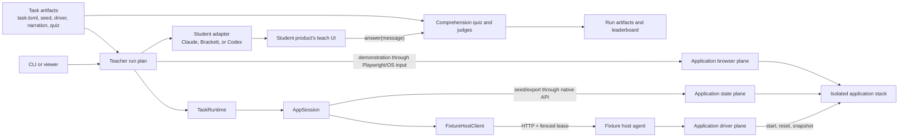
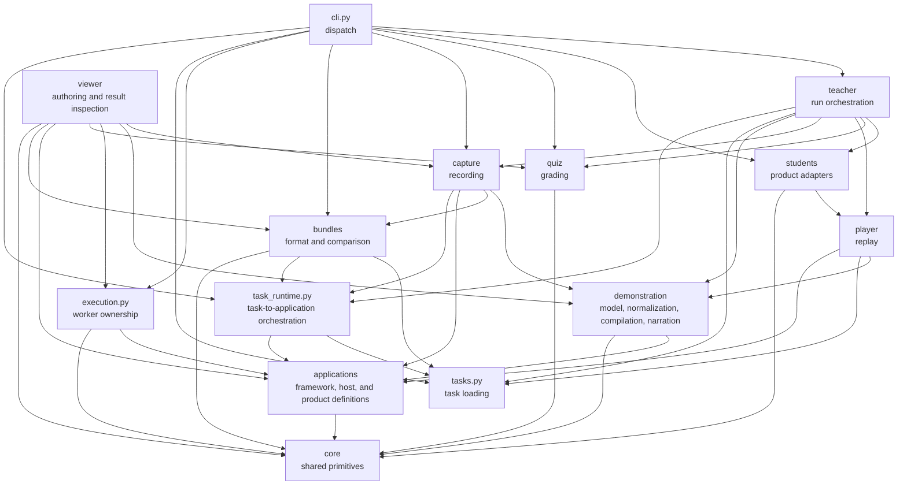

# `src/showAndTell` architecture guide

This document explains the current, tracked source tree under `src/showAndTell/`:
what each package owns, where it is used, how the main runtime entities
coordinate, and why the boundaries are useful. It describes the code as it
exists now, not the older flat layout shown in parts of the root README.

## The short version

ShowAndTell has two related pipelines:

1. **Authoring:** record browser activity, normalize it, compile it into a
   replayable task driver, and optionally compare its bundle with a reference.
2. **Benchmark execution:** start and seed the task's applications, let a
   student product observe the demonstration, quiz that product, and persist a
   score.

The package layout follows those lifecycle stages. Application-specific code is
kept in `applications/`; portable workflow artifacts are in `demonstration/`;
recording is in `capture/`; delivery is in `teacher/`; systems under test are
plug-ins under `students/`; replay is in `player/`; and grading is in `quiz/`.
The authoring and result-inspection web application lives in `viewer/` within
the same package.

## High-level entity coordination

The important separation is inside each application:

- The **driver plane** owns whether the application exists and runs beside
  Docker or the external service.
- The **state plane** owns deterministic task data and uses the application's
  supported API, IMAP, or connector.
- The **browser plane** owns semantic interaction with the visible UI.

That split prevents browser code from needing Docker access, prevents container
drivers from learning task schemas, and lets capture and replay share the same
UI operations.

## Package dependency view

The `demonstration/` extraction removes the former capture↔player and
player→teacher seams. Capture produces a demonstration, player consumes it,
and teacher coordinates both without either lower-level package importing the
teacher.

## Root package

| Path | Responsibility | Used by | Why it belongs here |
|---|---|---|---|
| `showAndTell/__init__.py` | Marks the single public top-level Python package. | Python packaging and all imports. | The wheel installs one project namespace rather than several generic top-level packages. |
| `showAndTell/cli.py` | Parses commands and dispatches to features. | The `showAndTell` console script declared in `pyproject.toml`. | Entry-point code stays thin and is allowed to depend on every feature package. Nothing should import it. |
| `showAndTell/tasks.py` | Loads `task.toml`, `task_logic.py`, and `demonstrate.py` safely and without leaking temporary module aliases. | Task runtime, teacher, player, bundles, students, the CLI, and tests. | Task artifacts are a shared domain concept, not owned by capture, replay, or grading alone. |
| `showAndTell/task_runtime.py` | Validates application-keyed task seeds and owns the seeded `AppSession` lifecycle. | Teacher, capture, CLI task serving, and bundle snapshots. | It coordinates tasks and applications, so placing it above both prevents either bounded context from importing the other. |
| `showAndTell/execution.py` | Claims worker numbers, ports, displays, Chrome profiles, and application leases. | Viewer/parallel execution and CLI worker setup. | Concurrency and ownership cut across products and applications, so they need one explicit boundary. |

## `viewer/`: author tasks and inspect benchmark results

| Module/resource | Responsibility | Used by |
|---|---|---|
| `serve.py` | Rebuilds and serves the local viewer, including loopback-only authoring APIs. | `./showAndTell viewer` and local contributors. |
| `serve_public.py` | Adds mandatory Basic Auth to the read-only public server. | The WebArena host service. |
| `generate.py` | Scans task/result artifacts and assembles a self-contained snapshot. | Live servers, static exports, and viewer tests. |
| `capture.py` | Coordinates new-task capture, draft promotion, trials, and publication. | Local viewer APIs. |
| `task_runs.py`, `executions.py`, `fixture_host.py` | Own task subprocesses and fixture-host execution leases. | Local viewer runs and captures. |
| `src/`, `seed_editor.html` | Framework-free JavaScript, CSS, page shells, and the seed editor. | Generated and live viewer pages. |

The viewer is an orchestration boundary, so it may depend on the lower-level
capture, demonstration, execution, quiz, applications, bundles, and core
packages. Those
packages never import the viewer.

## `core/`: dependency-light primitives

`core/` may not import higher ShowAndTell packages. This rule is enforced by
`tests/test_architecture.py`.

| Module | What it provides | Typical users |
|---|---|---|
| `audio.py` | Shared VB-CABLE/PulseAudio routing so narration reaches every recording product, with optional speaker monitoring. | CLI and `teacher.run`. |
| `cache.py` | Task fingerprinting and cached comprehension results. | CLI teach commands. |
| `chrome.py` | Managed Chrome profile, launch/kill, CDP calls, and window geometry. | CLI, capture, students, teacher, player, and execution. |
| `llm.py` | Small completion/JSON boundary with deterministic test mode. | Quiz judges and adapter answer checks. |
| `osinput.py` | Trusted macOS mouse and keyboard events. | Codex input and player OS-actuation layers. |
| `pwerrors.py` | Shared Playwright exception taxonomy and stale-read detection. | Browser adapters and OS-operation wrappers. |
| `tts.py` | Cross-platform speech synthesis commands. | Teacher narration via `core.audio`. |

Why this is a good boundary: these modules describe mechanisms, not benchmark
phases. Keeping them dependency-light prevents a low-level Chrome or LLM helper
from accidentally pulling in task orchestration.

## `applications/`: application framework and product definitions

This is the largest bounded context because it contains both the reusable
application framework and each deployable application definition. A directory
with an `app.toml` is discoverable; no central list needs updating.

### Framework modules

| Module | Responsibility | Where it is used |
|---|---|---|
| `manifest.py` | Validates application identity, ports, credentials, surface, health checks, capabilities, and replicas. | Registry, host agent, drivers, session, operational scripts, and tests. |
| `registry.py` | Discovers `*/app.toml` and dynamically loads `driver`, `state`, or `browser` planes. | AppSession and host-agent startup. |
| `session.py` | Composes multiple apps, holds one fenced lease, builds `AppContext`, and routes reset/seed/export/capture/snapshot operations. | Task runtime, capture flows, execution manager, and viewer. |
| `browser/context.py` | Binds supporting-app URLs, credentials, and metadata to a Playwright page. | Multi-application browser operations and generated drivers. |
| `browser/runtime.py` | Locates application browser planes and routes captured URLs, credentials, login, and readiness onto a live application session. | Capture, demonstration compilation, generated drivers, and replay. |
| `lifecycle/compose.py` | Reusable lifecycle for an app-owned Docker Compose project. | Fleetbase and Twenty directly; a base for similar apps. |
| `lifecycle/docker_image.py` | Reusable lifecycle for a single prebuilt Docker image. | GitLab, Kiwix, Magento, OpenStreetMap, and Postmill drivers. |
| `lifecycle/public_url.py` | Validates browser-visible origins. | Compose/image drivers and app drivers. |
| `authoring/seedform.py` | Declarative authoring forms for state that cannot be created from the app UI. | Stateful apps such as Roundcube through AppSession/viewer flows. |

### Infrastructure subpackages

| Folder | Responsibility | Why it is nested under `applications/` |
|---|---|---|
| `applications/browser/` | Browser context plus application-plane login, readiness, URL, and credential routing. | These modules coordinate all applications without owning a specific product. |
| `applications/lifecycle/` | Generic Compose/image lifecycle implementations and public-origin validation. | Concrete application drivers reuse this infrastructure. |
| `applications/authoring/` | Declarative metadata for application state that needs a generated editor. | This is application authoring infrastructure, not runtime orchestration. |
| `applications/host/` | HTTP client/API, driver protocol, command runner, exclusive leases, replica pools, and server entry point. | Client and server are two sides of the same application-host boundary. |

Task-owned orchestration lives one level above this bounded context in
`showAndTell/task_runtime.py`. It loads tasks, validates their application-keyed
seeds, starts `AppSession`, and exposes `TaskRuntime`, `running_task`, and
`booted_task`. Within `host/`, `client.py` is the local/remote boundary,
`api.py` defines HTTP routes, `protocol.py` defines the driver contract,
`leases.py` owns fencing, and `server.py` owns discovery and process startup.

### Discoverable application folders

The "live use" column reflects the benchmark's current 15 tasks. An app with no
live task is still useful for archived WebArena coverage, fixture development,
and its focused tests.

| Folder | What it represents and owns | Current live use |
|---|---|---|
| `erpnext/` | ERPNext + HRMS lifecycle, REST client, base company data, profile-based seeders, generated enterprise dataset, snapshots, and shared login/readiness behavior. Task workflow vocabulary stays in captured task demonstrations. | 13 tasks: `credit-release-queue`, `discount-request-review`, `job-offer-follow-up`, `job-requisition-broadcast`, `job-requisition-triage`, `limited-stock-order-allocation`, `low-stock-replenishment-sweep`, `order-request-replenishment`, `purchase-invoice-reconciliation`, `recruiter-performance-scorecard`, `return-eligibility-rma`, `rfq-quote-award`, and `shortage-substitution-queue`. |
| `fleetbase/` | Fleetbase Core + Fleet-Ops Compose lifecycle, bootstrap, deterministic maintenance dataset, and login surface. | `vehicle-maintenance-service-booking`. |
| `gitlab/` | WebArena GitLab lifecycle and issue-management browser operations. | No current live task. |
| `kiwix/` | Offline Wikipedia/Kiwix lifecycle and search/article browser operations. | No current live task. |
| `magento/` | Magento storefront lifecycle, REST state seeding, shopping operations, and price-watch helpers. | No current live task. |
| `magento_admin/` | Magento Admin view of the same deployment, with order/review/catalog operations. | No current live task. Its driver delegates shared lifecycle to `magento/`. |
| `onlyoffice/` | Document Server, storage connector, workbook materialization, mutable state plane, and spreadsheet browser operations. | `candidate-role-rematching` plus the 13 ERPNext spreadsheet-assisted tasks. |
| `openstreetmap/` | Boundary for an externally managed OpenStreetMap stack and map/directions browser operations. | No current live task. |
| `postmill/` | WebArena Postmill lifecycle and forum/post/comment operations. | No current live task. |
| `roundcube/` | Roundcube + Dovecot Compose lifecycle, IMAP seeding, mail state, and inbox browser operations. | `job-offer-follow-up`, `job-requisition-broadcast`, `job-requisition-triage`, `limited-stock-order-allocation`, `purchase-invoice-reconciliation`, `shortage-substitution-queue`, and `vehicle-maintenance-service-booking`. |
| `twenty/` | Twenty CRM lifecycle, API client, bootstrap, deterministic CRM dataset, state plane, and opportunity UI operations. | No current live task. |

### Application-specific supporting folders

| Folder | Purpose | Classification |
|---|---|---|
| `erpnext/hrms/` | HRMS workforce data, provenance, and task seed/reset helpers used by `erpnext.state`. | Nested support for the combined ERPNext application; it has no separate deployment or browser plane. |
| `erpnext/snapshots/` | Golden ERPNext database snapshot and its documentation. | Packaged data, not a Python package. |
| `onlyoffice/host-page/` | The HTML editor host used by the ONLYOFFICE connector. | Packaged web resource, not a Python package. |
| `roundcube/config/` | TLS configuration mounted by Roundcube Compose. | Packaged runtime configuration, not a Python package. |

This organization is appropriate because code, manifests, Compose files,
datasets, and mounted configuration for one product travel together in the
wheel. A contributor can add or reason about an application locally without
editing unrelated registries.

## `demonstration/`: represent and transform the portable lesson

| Module | Responsibility | Used by |
|---|---|---|
| `model.py` | Lossless typed values for surfaces, normalized events, narration beats, and a complete `Demonstration`. | Capture, compiler, player, and tests. |
| `events.py` | Normalizes/deduplicates raw gestures and aligns narration with stable action keys. | Capture and compiler. |
| `compiler.py` | Compiles a typed demonstration into a deterministic `demonstrate.py` replay driver. | Capture authoring and player compatibility regeneration. |
| `narration.py` | Loads validated narration beats, creates idempotent narration callbacks, and locates recorded human audio. | Teacher and player. |

This is the stable boundary between observing a workflow and using it. It
describes or transforms a demonstration but does not record browsers, execute
gestures, control student products, or grade results.

## `capture/`: turn human activity into a replayable draft

| Module/resource | Responsibility | Used by |
|---|---|---|
| `runtime.py` | Owns a managed-Chrome capture, logs in to declared surfaces, collects events and accessibility data, and writes a draft. | Viewer capture workflows and capture trials. |
| `recorder.js` | Browser-injected event recorder. | `ManagedCapture`. |
| `transactions.py` | Merges begin/settle/outcome events into ordered click transactions. | Recorder/capture runtime and transaction tests. |
| `screenrec.py` | Best-effort OS video and input-audio recording. | CLI teach runs and trial recording. |
| `demo_record.py` | Records a canonical task demonstration from managed Chrome. | `showAndTell demo-record`. |

It is correctly separate from `teacher/`: capture observes a human and creates
an artifact; the teacher consumes an artifact or task driver to teach a product.

## `teacher/`: orchestrate delivery of the lesson

| Module | Responsibility | Used by |
|---|---|---|
| `run.py` | Builds one plan—launch, seed, arm, demonstrate, conclude, quiz—then executes it for a selected student adapter. | CLI teach commands and viewer capture trials. |

The teacher owns the use case rather than any product integration. It talks to
students through `ProductAdapter`, to quiz through a plain `ask(message)`
callback, and to the task/application runtime through shared contracts.

## `students/`: systems under test

| Module | Responsibility | Used by |
|---|---|---|
| `base.py` | Defines the `ProductAdapter` hook contract and per-run `Session`. | Teacher and every adapter. |
| `registry.py` | Lazily maps stable names to adapter classes. | CLI choices and teacher run startup. |
| `claude.py` | Drives Claude-in-Chrome Teach through its side panel. | `showAndTell claude-teach`. |
| `brackett.py` | Drives Brackett Show and Tell and its extension lifecycle. | `showAndTell brackett-teach`. |
| `codex.py` | Drives Codex/ChatGPT Record & Replay. | `showAndTell codex-record` and trials. |
| `codex_input.py` | Accessibility-targeted native Chrome input used by Codex flows. | Codex adapter. |

This is the extension point: adding another system under test requires one
adapter module and one lazy registry entry. `quiz/` does not import students,
and students do not import the teacher, which keeps product-specific UI logic
out of benchmark policy.

## `player/`: execute an existing demonstration

| Module | Responsibility | Used by |
|---|---|---|
| `replay.py` | Runtime library used by generated drivers: pacing, resilient target resolution, frame routing, typing, drag geometry, and recovery. | Every generated task `demonstrate.py`, capture, bundles, and trials. |
| `trial.py` | Loads viewer drafts, remaps captured origins, opens surfaces, restores state, and replays generated actions. | Teacher trial mode. |
| `osactuator.py` | Converts abstract actions to trusted OS input. | Codex adapter. |
| `osops.py` | Playwright-like proxy/ops surface backed by OS gestures. | Codex adapter and task operation drivers. |

Replay is a distinct runtime concern: generated drivers depend on it, while
the teacher decides when and for which student product a replay occurs.

## `quiz/`: measure what was learned

| Module | Responsibility | Used by |
|---|---|---|
| `comprehend.py` | Builds the question message, parses answers, grades all questions, and prints results. | Teacher and CLI cache display. |
| `judge.py` | Deterministic closed/multiple-choice grading and rubric/LLM judging. | `comprehend.py` and question audit tests. |
| `complexity.py` | Calculates Task Complexity Index from task artifacts. | Viewer, reports, and tests. |
| `leaderboard.py` | Aggregates `runs/*/comprehend.json` into terminal, Markdown, HTML, and JSON boards. | `showAndTell leaderboard`. |

The package receives an answer callable rather than knowing which student
produced the answer. That dependency inversion makes scores comparable across
products and keeps grading testable without launching a browser.

## `bundles/`: inspect the Show-and-Tell interchange format

| Module | Responsibility | Used by |
|---|---|---|
| `parse.py` | Parses steps, targets, metadata, and accessibility trees. | Capture authoring and bundle tools. |
| `snapshot.py` | Replays a task against its fixture to create a bundle-shaped reference. | `showAndTell bundle-snapshot`. |
| `diff.py` | Scores semantic alignment between two bundles. | `showAndTell bundle-diff`. |
| `hub.py` | Fetches published task bundles from the Hugging Face dataset (`resolve_task_dir`, fixture-host placeholder substitution). | CLI task resolution and the viewer's dataset view. |

Bundle tooling is separate because the format is useful for authoring and
fixture-fidelity analysis even when no student product is being benchmarked.

## End-to-end sequence

1. `cli.py` or the viewer selects a task and a student product.
2. `tasks.py` validates the task declaration and loads its driver.
3. The selected `ProductAdapter` contributes launch/arm/conclude/chat hooks.
4. `teacher.run` asks `task_runtime` to start the task.
5. `TaskRuntime` creates an `AppSession` in primary-application-first order.
6. `AppSession` acquires one lease through `FixtureHostClient` and starts each
   application's lifecycle driver through the host agent.
7. The runtime resets state, restores declared snapshots, and seeds each
   application's state plane.
8. The teacher performs the task driver through Playwright or trusted OS input
   while narration is routed into the student's recorder.
9. The adapter ends the teaching session and exposes its chat transport.
10. `quiz.comprehend` sends the fixed quiz through that transport, grades the
    response, and writes `comprehend.json`.
11. `quiz.leaderboard` can later aggregate compatible run artifacts without
    knowing how any run was taught.

## Why the organization is sound

- **It mirrors the domain language.** Capture, teacher, student, player, quiz,
  bundle, task, and application each mean one thing in the benchmark.
- **It separates policy from mechanism.** The teacher owns ordering, the quiz
  owns scoring policy, applications own product mechanics, and core owns small
  reusable mechanisms.
- **It has explicit extension points.** Student adapters use `ProductAdapter`;
  application definitions use `app.toml` plus three planes.
- **It supports local and remote fixtures with the same harness code.** Only
  `FixtureHostClient` changes destination; task seeds remain harness-side.
- **It keeps state deterministic and fenced.** `AppSession` routes app-keyed
  seed blocks while the host agent enforces exclusive leases and snapshots.
- **It packages code with its runtime resources.** Compose files, templates,
  datasets, snapshots, and browser operations stay beside their application.
- **It protects dependency direction.** Architecture tests forbid core from
  reaching upward, quiz from importing students, students from importing the
  teacher, applications from importing benchmark phases, and any module from
  importing the CLI.

## Current exceptions and honest caveats

The structure is strong, but "rightly organized" does not mean finished:

- `capture.runtime` still imports bundle serialization helpers while authoring
  its bundle-shaped evidence. That coupling is format-related, not a dependency
  on replay or teaching.
- `core/audio.py` and `core/tts.py` are dependency-light and shared today, even
  though narration is conceptually teacher-facing. Their current placement is
  pragmatic rather than a pure domain boundary.
- HRMS support is nested under `erpnext/hrms/` because ERPNext and HRMS share
  one Frappe site, manifest, lifecycle, state plane, and browser plane.

These exceptions are localized and visible; they do not invalidate the main
boundaries.

## What is not a source package

Ignore `__pycache__/` directories and `.pyc` files. They are local interpreter
artifacts, not architecture. Some application names may appear on disk only as
stale cache directories after source moves. They have no tracked source files and are not discovered
applications.

## Related documents

- [Applications and their three planes](APPLICATIONS.md)
- [Task application runtime](TASK_RUNTIME.md)
- [Benchmark design](DESIGN.md)
